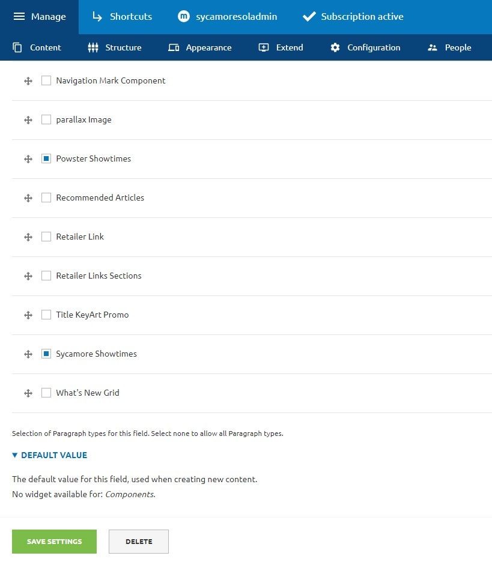

# Sycamore Showtimes component for Sony Portal
This module consists of process to embed Sycamore's Showtimes component.

The module has been created in consultation with SonyPictures Entertainment team to enable showtimes component to the leading SonyPictures portal running on drupal.

## Motivation
Showtimes Component was included within SonyPictures Portal as an iframe. SonyPictures Entertainment aimed to achieve analytics tracking of the Showtimes Component within the Portal analytics container.

## Compatibility
The module should be compatible with 8.2.0 < Drupal < 10.2.4. The module is developed and tested against Drupal 9.

## Usage
### Step 1 - Install Module
Upon installing the module, this module installs a new paragraph/component type called 'Sycamore Showtimes'. This paragraph has two fields called 'Heading' & 'Movie Assets Path'.

### Step 2 - Add the 'Sycamore Showtimes' paragraph to your content
Place paragraph anywhere in your content. Currently the component resides as a Iframe on Title Page ('/admin/structure/types/manage/title_page/fields/node.title_page.field_components'). In 'Heading', add a section heading. It can be kept blank if heading is not required. In 'Movie Assets Path', add the Sycamore url which you want to embed.
You are all good to go. Refresh the cache and visit the page.(resources/demo.jpg)

## Installation to existing Drupal system
Please move the `modules/custom/sycamore_showtimes` to suitable module destination and enable the Sycamore Showtimes module in Drupal extensions' admin panel.
